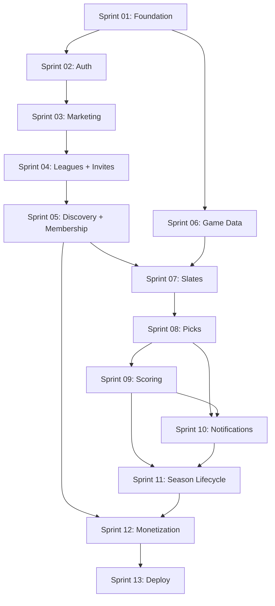

# Callsheet — Sprint Plans

> Build roadmap for v0.2.0 greenfield rebuild.  
> Each sprint is a self-contained plan with stories and acceptance criteria.

## How to use these plans

1. Read [`docs/DECISIONS.md`](../docs/DECISIONS.md) for the full decision record
2. Work sprints **in order** — each builds on the previous
3. Mark stories complete in the sprint file as you go
4. Do not skip sprint dependencies listed in each plan

## Sprint overview

| Sprint | Name | Goal | Depends on |
|--------|------|------|------------|
| [01](./sprint-01-foundation.md) | Foundation & Infrastructure | Monorepo, DB schema, Docker, delete legacy | — |
| [02](./sprint-02-auth-and-users.md) | Auth & Users | Clerk integration, user sync, theme prefs | 01 |
| [03](./sprint-03-marketing-and-shell.md) | Marketing & App Shell | Landing page, layouts, protected routing | 02 |
| [04](./sprint-04-league-creation-and-invites.md) | League Creation & Invites | Create league, Discord-style invite flow | 03 |
| [05](./sprint-05-discovery-and-membership.md) | Discovery & Membership | Public browse, join, waitlist, season lock | 04 |
| [06](./sprint-06-game-data-pipeline.md) | Game Data Pipeline | ESPN sync, games table, cron setup | 01 |
| [07](./sprint-07-commissioner-slates.md) | Commissioner Slates | Weekly game selection, min 4, lock rules | 05, 06 |
| [08](./sprint-08-pick-submission.md) | Pick Submission | Member pick UI, kickoff locking | 07 |
| [09](./sprint-09-scoring-and-leaderboards.md) | Scoring & Leaderboards | Score picks, weekly + season standings | 08 |
| [10](./sprint-10-notifications-and-jobs.md) | Notifications & Jobs | Absurd worker, Resend emails, reminders | 08, 09 |
| [11](./sprint-11-season-lifecycle.md) | Season Lifecycle | Archive, rollover, commissioner transfer | 09, 10 |
| [12](./sprint-12-monetization.md) | Monetization | Clerk Billing, Pro gating, upgrade UI | 05, 11 |
| [13](./sprint-13-deploy-and-launch.md) | Deploy & Launch | Netlify, Fly.io, CI, polish | All |

## Dependency graph

## Definition of done (global)

A sprint is complete when:

- [ ] All stories marked done with acceptance criteria met
- [ ] TypeScript compiles with no errors (`turbo typecheck`)
- [ ] Lint passes (`turbo lint`)
- [ ] New API endpoints documented in sprint file
- [ ] Environment variables added to `.env.example`
- [ ] Changes committed and pushed to `v0.2.0`
